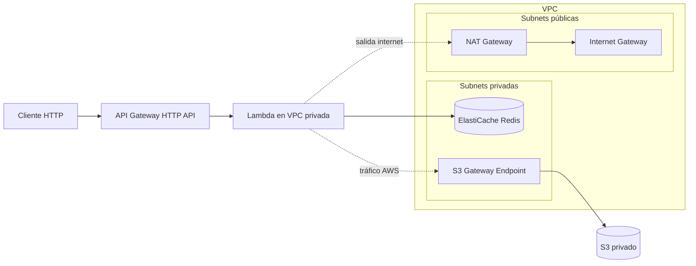

# Arquitectura Serverless para Prueba Técnica SRE

Implementación en Terraform de una arquitectura serverless en AWS con VPC, API Gateway HTTP API, Lambda en subnets privadas, ElastiCache Redis y S3 privado.

## Arquitectura



## Decisiones de diseño


- HTTP API en API Gateway por simplicidad, menor costo y soporte suficiente para proxy integration, CORS, logging y throttling por stage.

- Lambda en subnets privadas para aislar el cómputo del acceso directo a internet.

- NAT Gateway para permitir salida controlada cuando Lambda necesite resolver dependencias externas.

- VPC Gateway Endpoint para S3 para mantener el tráfico hacia el bucket dentro de la red de AWS.

- Redis cache.t3.micro como opción económica, con acceso restringido únicamente desde el Security Group de Lambda.

- S3 privado con Block Public Access, versioning habilitado y bucket policy limitada al execution role de Lambda.

## Estructura

```text
.
├── tf-modularized/
├── lambda/
├── scripts/
└── evidence/
```

## Prerrequisitos

- Terraform >= 1.5
- AWS CLI configurado con credenciales válidas
- Python 3.11+
- zip disponible en el sistema
- Permisos para crear: VPC, Subnets, NAT Gateway, IAM Roles/Policies, Lambda, API Gateway v2, ElastiCache, S3, CloudWatch Logs

## Variables

Copia y ajusta:

```bash
cd tf-modularized
cp terraform.tfvars.example terraform.tfvars
```

Variables importantes:
- `aws_region`
- `project_name`
- `vpc_cidr`
- `public_subnet_cidrs`
- `private_subnet_cidrs`
- `throttle_rate_limit`
- `throttle_burst_limit`

## Empaquetar Lambda

Desde la raíz del repo:
Linux / macOS
```bash
bash scripts/package_lambda.sh
```
En windows
scripts/package_lambda.ps1


Esto genera el artefacto `lambda/lambda.zip`.

## Despliegue

```bash
cd tf-modularized
terraform init
terraform plan
terraform apply -var-file=terraform.tfvars
```
## Para eliminar los recursos al finalizar:
```bash
terraform destroy -var-file=terraform.tfvars
```
## Outputs esperados

- `api_base_url`
- `bucket_name`
- `redis_primary_endpoint`

## Verificación end-to-end

Linux / macOS
```bash
API_URL="$(terraform -chdir=terraform output -raw api_base_url)"

curl -i -X POST "${API_URL}/process" \
  -H 'Content-Type: application/json' \
  -d '{"text":"Realizando una petición"}'

curl -i -X POST "${API_URL}/process" \
  -H 'Content-Type: application/json' \
  -d '{"text":"Realizando una petición"}'
```
Windows / PowerShell
```
$API_URL = "tu_url/process"

try {
    $r = Invoke-WebRequest -Method POST -Uri "$API_URL" `
     -ContentType "application/json" `
     -Body '{"text":"Realizando una petición"}' `
     -UseBasicParsing
   $r.StatusCode
   $r.Headers
   $r.Content
 }
 catch {
   $_.Exception.Response.StatusCode.value__
   $reader = New-Object System.IO.StreamReader($_.Exception.Response.GetResponseStream())
   $reader.ReadToEnd()
 }
```
La primera debe retornar `X-Cache: MISS` y la segunda `X-Cache: HIT`.

## Notas

- Si el nombre global del bucket colisiona, cambia project_name.
- Para reducir costos, destruye el stack al terminar la evaluación.
- La Lambda escribe los resultados en results/<fecha>/<id>.json.


